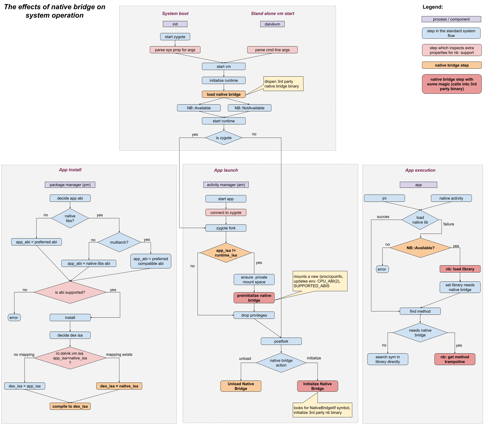

# Native Bridge

A native bridge enables apps with native components to run on systems with
different ISA or ABI.

For example, an application which has only native ARM binaries may run on an x86
system if there’s a native bridge installed which can translate ARM to x86. This
is useful to bootstrap devices with an architecture that is not supported by the
majority of native apps in the app store (it closes the gap between the number
of apps that can be run on that particular architecture).

Starting from L, AOSP supports native bridges (note that it *does not* provide
an actual native bridge).

The `libnativebridge` library handles loading of native libraries with a foreign
ISA (aka *translated* libraries in the *guest* environment) into a managed JVM
process using the native ISA in the *host* environment. Note that loading
translated libraries and their dependencies in the guest environment is done by
a separate linker, which typically uses a different linker config than the host
one.

See also [design doc](http://go/native-bridge) (internal only).
